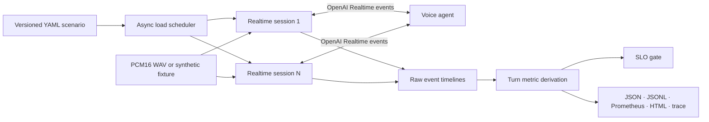

# s2s-bench

`s2s-bench` measures what users feel and operators debug in a realtime voice agent: turn-finalization delay, final-transcript delay, LLM first text, TTS first audio, end-to-end time to first audio, cancellation time, stale output, and failure rate.

It drives the OpenAI Realtime WebSocket event set, including the implementation in [Hugging Face speech-to-speech](https://github.com/huggingface/speech-to-speech). It runs the same checked-in scenario against a local model stack, a remote deployment, or the deterministic mock target included here.

The benchmark keeps the wire timeline as its source of truth. Every aggregate can be traced back to a timestamped event in `events.jsonl` or viewed in Perfetto with `trace.json`.

## Why this exists

Voice systems can post a good median while failing real conversations. A useful harness must cover distribution tails, concurrent sessions, cancellation, event order, stale audio, transport faults, and recovery. A single end-to-end stopwatch hides which stage regressed.

The metric split follows production patterns documented by [LiveKit](https://docs.livekit.io/deploy/observability/data/) and [Pipecat](https://github.com/pipecat-ai/docs/blob/main/pipecat/fundamentals/stt-latency-tuning.mdx): correlate stage timings by turn, retain end-to-end latency, and run repeatable scenarios in CI. The async session model follows the code-defined concurrent-user pattern used by [Locust](https://github.com/locustio/locust), but models a stateful audio stream and Realtime protocol directly.

## Quick start

Requirements: Python 3.11+ and [`uv`](https://docs.astral.sh/uv/).

```bash
git clone https://github.com/jackboyla/s2s-bench.git
cd s2s-bench
uv sync --all-extras --dev
```

Start the deterministic target in one shell:

```bash
uv run s2s-bench mock
```

Run eight sessions, with four active at once, in another:

```bash
uv run s2s-bench run examples/mock-smoke.yaml --output artifacts/smoke
```

The command exits `0` only when all turns and SLO budgets pass. It exits `2` for a failed turn, budget, or invalid scenario, so it works as a CI gate.

Open `artifacts/smoke/report.html` for the dashboard. Open `trace.json` in [Perfetto](https://ui.perfetto.dev/) to inspect the event timeline.

## What it measures

All durations use the client's monotonic clock. This avoids wall-clock jumps and removes the need to sync clocks with the server.

| Metric | Start | End | What it isolates |
|---|---|---|---|
| `vad_finalize` | last input chunk sent | `speech_stopped` | network tail plus server VAD finalization |
| `stt_final` | `speech_stopped` | final input transcript | final ASR work after turn close |
| `llm_first_text` | final input transcript | first assistant text delta | queueing, prompt work, and LLM TTFT |
| `tts_first_audio` | first assistant text delta | first output audio | TTS queueing and first-byte work |
| `e2e_first_audio` | `speech_stopped` | first output audio | user turn close to playable response |
| `response_complete` | `speech_stopped` | `response.done` | full response time |
| `cancellation` | client `response.cancel` | cancelled `response.done` | cancellation propagation |

The harness also reports:

- success rate across attempted turns;
- protocol order violations, such as audio before `response.created`;
- audio received after terminal `response.done`;
- setup errors, server errors, timeouts, and unexpected response states;
- p50, p95, p99, max, and mean for every observed latency.

## Architecture



One `asyncio` task owns each WebSocket session. A bounded semaphore controls active sessions, while `sessions` controls the total sample count. This keeps the offered load clear: `concurrency` means live conversations, not HTTP requests.

The runner records audio sends and server events before it derives metrics. Large audio bodies become a byte count and a short SHA-256 digest in traces, so reports stay small while repeated chunks remain identifiable.

## Benchmark Hugging Face speech-to-speech

Start `speech-to-speech` in Realtime server mode according to its README. Then copy the example and point it at a real utterance:

```bash
cp examples/huggingface-speech-to-speech.yaml my-local-run.yaml
# Edit the WAV path, load, and budgets.
uv run s2s-bench run my-local-run.yaml --output artifacts/hf-local
```

Audio files must be mono PCM16 WAV at the sample rate declared in the scenario. Include roughly 500 ms of trailing silence; server VAD needs audio after the spoken phrase to observe its end. Cold and warm turns remain separate in `turns.json`; the aggregate report includes both, so run a second scenario when model startup is not part of the target SLO.

To test a protected endpoint without putting a token in Git:

```yaml
target:
  url: wss://voice.example.com/v1/realtime
  headers:
    Authorization: Bearer ${VOICE_API_KEY}
```

Environment variables expand when the scenario loads. Event artifacts can contain transcripts and server error text, so treat them as user data.

## Scenario contract

```yaml
version: 1
name: overloaded-with-jitter
target:
  url: ws://127.0.0.1:8765/v1/realtime?model=local
load:
  sessions: 50
  concurrency: 8
  ramp_up_s: 10
timeout_s: 45
faults:
  send_jitter_ms: 30
  drop_audio_probability: 0.01
  seed: 42
session:
  type: realtime
  audio:
    input:
      turn_detection: {type: server_vad, interrupt_response: true}
turns:
  - name: normal
    audio:
      source: ./fixtures/question-24khz.wav
      sample_rate: 24000
      chunk_ms: 20
      pace: true
  - name: interrupt
    audio: ./fixtures/question-24khz.wav
    cancel_after_first_audio_ms: 100
budgets:
  - {metric: success_rate, min_rate: 0.99}
  - {metric: e2e_first_audio, percentile: p95, max_ms: 1200}
  - {metric: cancellation, percentile: p95, max_ms: 200}
```

`send_jitter_ms` adds a seeded uniform delay before each audio chunk. `drop_audio_probability` drops seeded chunks before send. The seed changes per session in a stable way, so reruns reproduce the same fault pattern.

Synthetic audio (`synthetic:<frequency_hz>:<duration_ms>`) exists only for mock and harness tests. Use recorded speech to test a real VAD and ASR stack.

## Artifacts

Each run writes a set that works for humans, CI, and monitoring systems:

| File | Purpose |
|---|---|
| `summary.json` | run metadata, distributions, budgets, and pass/fail state |
| `turns.json` | one compact result per turn |
| `events.jsonl` | audit log of timestamped sent and received events |
| `trace.json` | Chrome Trace Event format for Perfetto |
| `metrics.prom` | Prometheus text exposition |
| `report.md` | pull-request and terminal-friendly summary |
| `report.html` | self-contained dashboard with no server or CDN |

Compare two run summaries:

```bash
uv run s2s-bench compare artifacts/base/summary.json artifacts/candidate/summary.json \
  --output artifacts/comparison.md
```

## Failure drills

The mock target makes negative-path tests cheap and repeatable:

```bash
# Fail every fifth response.
uv run s2s-bench mock --fail-every 5

# Inject known bad output for stale-event detector work.
uv run s2s-bench mock --stale-audio-after-cancel

# Change stage delays to verify attribution and SLO gates.
uv run s2s-bench mock --stt-ms 300 --llm-ms 600 --tts-ms 250
```

For a real deployment, add client-side jitter and loss in YAML. Use a network proxy or Linux traffic control when you also need reordering, bandwidth caps, TCP resets, or server-to-client impairment; those belong below the application protocol and should not be faked in the client.

## Reproducible development

These are the commands CI runs and the commands to rerun after a checkout:

```bash
uv sync --all-extras --dev
uv run ruff check .
uv run ruff format --check .
uv run mypy
uv run pytest --cov --cov-report=term-missing
```

For a local smoke run:

```bash
uv run s2s-bench mock
uv run s2s-bench run examples/mock-smoke.yaml --output artifacts/smoke
```

See [`progress/experiment-log.md`](progress/experiment-log.md) for exact project runs and machine state.

## Limits

- WebSocket is the first transport. WebRTC needs media-plane timestamps and loss stats that do not map cleanly to this adapter.
- The client sees boundary-to-boundary latency. It cannot split server queue time from model inference without server spans.
- `llm_first_text` depends on a target emitting assistant text deltas. End-to-end first audio still works if it does not.
- Client cancellation tests `response.cancel`. Server-VAD barge-in needs a second overlapping utterance and is planned as a separate scenario action.
- A small sample can produce a precise percentile calculation but not a stable tail estimate. For p99 claims, run hundreds of turns and report the sample count.

## Contributing

Please open an issue before changing the scenario schema or event model. Run `make check test` before a pull request. See [CONTRIBUTING.md](CONTRIBUTING.md).

Apache-2.0 licensed.
